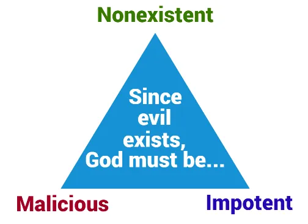

+++
title = 'The Epicurean Trilemma'
date = 2023-12-25T16:06:15-05:00
draft = false
+++

## Attack

A trilemma is a difficult choice between three unacceptable options. Attributed to pre-Christ Greek philosopher [Epicurus](https://en.wikipedia.org/wiki/Epicurus) but popularized by [David Hume](https://en.wikipedia.org/wiki/David_Hume), this trilemma seems to make the omnipowerful and omni-loving God illogical by offering three compromising but logically consistent options.

Here are the premises:

> 1. If God is unable to prevent evil, then he is not all-powerful.
> 2. If God is not willing to prevent evil, then he is not all-good.
> 3. If God is both willing and able to prevent evil, then why does evil exist?

If all the premises are true and accurately defined, then the Christian God cannot be all-powerful and all-good at the same time.

The argument takes many forms in modern debates, often devolving into the **problem of evil**. Other times, the offense attempts to focus on compromising one of God's essential traits.

## Defense

The issue with Epicurus' argument lies not in *logic* but in *definition*. Particularly, there are two terms that are misdefined: **all-good** and **all-powerful**.

### Premise 1: God's Power

Let's tackle **all-powerful** first. The offense's definition of God as being all-powerful probably goes something like this: God can do anything. This statement is true, but it easily falls into **logical fallacy**. One may then ask: Can God sin? Of course not, since he is by essence **good**, but wouldn't that make God not all powerful? Sinning is some thing that he cannot do. The truth is that the question *Can God sin?* is a logical contradiction that doesn't make sense, illustrating the lack of clarity of the original question. Consider these passages:

*Oh, taste and see that the Lord ***is good!**** Psalm 34:8

*This is the message we have heard from him and proclaim to you, that God ***is light***, and in him is no darkness at all.* 1 John 1:5

*And Jesus said to him, “Why do you call me good? No one ***is good*** except God alone.* Luke 18:19

Notice the verb of being used in each of these verses. In English, we assume that the adjectives after *is* (good and light) are simply describing God. It goes deeper than that; these verses are a statement about God's nature, meaning that God **is** good just as light **is** bright. *Bright* is not only an attribute, it's light's true nature, its identity. They are one and the same.

Now, bring back the question: Can God sin? What the question is essentially asking is: Can good be bad? Obviously not. It has nothing to do with good's lack of power, only its nature. God does not compromise his power by being unable to sin; in fact, he upholds the principle of logic by being so. If we believe that God binds himself to logic when he lets us understand a fraction of him, then there is no issue here. Thus, let's rephrase our definition:
**God can do anything that is not contrary to his nature.** 

This definition clearly establishes what *God is all-powerful* means, and it provides the basis for attacking the second premise.

### Premise 2: God's Goodness

Premise two states: *If God is not willing to prevent evil, then he is not all-good.*

The definition of this one funny little word *good* causes monumental disparity between Christian and non-Christian. Due to the depth of this topic, there is [another page here (WIP)](/) about the problem of evil for further reading. Here, we'll focus on tackling the second premise of the trilemma.

Let's begin by defining good from the Christian perspective. The most important concept here is that the word *good* has 2 meanings (or *scopes* if you want to sound fancy) in Christian theology.

**Chaotic/Local good** - that which seems correct and orderly to human intuition but lacks universality and consensus

**Cosmic/Absolute/Universal good** - that which is universally orderly and harmonious throughout space and time by the ultimate standard

Read over these definitions a few times, and note that the words *chaotic* and *cosmic* are used in their [philosophical definitions](https://protesilaos.com/books/2022-02-05-cosmos-logos-living-universe). Evil, then is the opposite of these terms; replace orderly, harmonious, and correct with chaotic, terrible, and amiss. Most atheists making the Epicurean argument typically conflate these two types of evil/good into one. To them, *their* local good is the same as (or very similar to) universal good. 

First, a good question to counter: Why should I trust your definition of good? How do you know that you don't have a warped sense of good, and God is truly perfect?

God, if he existed, would have different moral values than any human does. He would be infinitely wiser and smarter than any hunk of cells he created. It is not a leap in logic to see that the same being that created spacetime, wrote the laws of science, established metaphysical concepts such as beauty, math, logic, musical harmony, and time, and molded the universe from nothing, this being has the capability to see that temporary evil leads to infinite perfection. Humans are finite, dumb, and ignorant. Who are we to judge absolute good and evil in the scope of all time as finite creatures?

Think of your favorite movie ever. Chances are it includes a protagonist who suffers some injustice and overcomes it in the end. Humans love the ideas of redemption, heroicism, and victory. However, movies would not be exciting if nothing bad happened and the character got what they wanted without any real obstacles. There is no saving of humanity without humanity's fall in the first place. God deemed it best that we choose between right and wrong, otherwise we are no more than moist robots programmed to give him praise.

This arguments follows:
**If God is real, all-good, and all-powerful, then finite evil must be necessary for infinite perfection.**

## Conclusion

The Epicurean Trilemma boils down to a fundamental lack of understanding of good. Specifically, God's place in the universe is vastly different from ours. He defines good; we do not.

*If God is both willing and able to prevent evil, then why does evil exist?*

**Evil exists because God, as a being infinitely more supreme and wise than us, deemed it necessary to give humans free will and let evil into the world in order to create perfect, infinite good.**

## Flipping the Attack

- *Morality doesn't exist in Atheism* (PAGE WIP)
- *Evil is proof of God* (PAGE WIP)

## Recursive Rebuttals

*How can God have the right to impose infinite punishment for finite sins?* (PAGE WIP)
- Don't think of Hell first as a fiery pit, think of it as separation from God
    - God is literally, in all essence, Good, Perfect, Love, Justice, and Peace
    - Anyone who rebels against God rebels against the concept of Good itself
    - They get what they want and what they reaped in life: eternal separation from Good
*Good is a construct of evolution that leads to societal improvement and reproduction.* (PAGE WIP)
- Sacrificial, selfless love seeks no benefits, yet it is the noblest of all loves

## Sources
1. [Ronald Kimmons, *Facing The Epicurean Trilemma*](https://medium.com/@ronald_37940/facing-the-epicurean-trilemma-cf0f690a7daf)
2. [Protesilaos Stavrou, *Cosmos, Logos, and the living universe*](https://protesilaos.com/books/2022-02-05-cosmos-logos-living-universe/)
3. [Wikipedia - Epicurus](https://en.wikipedia.org/wiki/Epicurus)
4. [Wikipedia - David Hume](https://en.wikipedia.org/wiki/David_Hume)