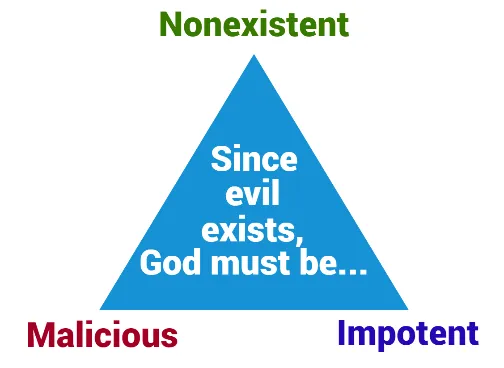

+++
title = 'The Epicurean Trilemma'
date = 2023-12-25T16:06:15-05:00
draft = false
+++

## Attack

A trilemma is a difficult choice between three unacceptable options. Attributed to pre-Christ Greek philosopher [Epicurus](https://en.wikipedia.org/wiki/Epicurus), this trilemma seems to make the omnipowerful and omni-loving God illogical by offering three compromising but logically consistent options.

Here are the premises:

> 1. If God is unable to prevent evil, then he is not all-powerful.
> 2. If God is not willing to prevent evil, then he is not all-good.
> 3. If God is both willing and able to prevent evil, then why does evil exist?

If all the premises are true and accurately defined, then the Christian God cannot be all-powerful and all-good at the same time.

The argument takes many forms in modern debates, often devolving into the **problem of evil**. Other times, the offense attempts to focus on compromising one of God's essential traits.

## Defense

The issue with Epicurus' argument lies not in *logic* but in *definition*. Particularly, there are two terms that are misdefined: **all-good** and **all-powerful**.

### God's Power

Let's tackle **all-powerful** first. The offense's definition of God as being all-powerful probably goes something like this: God can do anything. This statement is true, but it easily falls into **logical fallacy**. One may then ask: Can God sin? Of course not, since he is by essence **good**, but wouldn't that make God not all powerful? That is still some thing that he cannot do. The truth is that the question itself is a logical contradiction that doesn't make sense. Consider these passages:

*Oh, taste and see that the Lord ***is good!**** Psalm 34:8

*This is the message we have heard from him and proclaim to you, that God ***is light***, and in him is no darkness at all.* 1 John 1:5

*And Jesus said to him, “Why do you call me good? No one ***is good*** except God alone.* Luke 18:19

Notice the verb of being used in each of these verses. In English, we assume that the adjectives after *is* (good and light) are simply describing God. It goes deeper than that; these verses are a statement about God's nature, meaning that God **is** good just as light **is** bright. *Bright* is not only an attribute, it's light's true nature, its identity. They are one and the same.

Now, bring back the question: Can God sin? What the question is essentially asking is: Can good be bad? Obviously not. It has nothing to do with good's lack of power, only its nature. God does not compromise his power by being unable to sin; in fact, he upholds the principle of logic by being so. God binds himself to logic when he lets us understand a fraction of him. Thus, let's rephrase our definition:
**God can do anything that is not contrary to his nature.** 

### God's Goodness

The definition of this one funny little word *good* causes monumental disparity between Christian and non-Christian. Due to the depth of this topic, there is [another page here (WIP)](/) about the problem of evil for further reading. Here, we'll focus on tackling the second premise of the trilemma.

Premise two states: *If God is not willing to prevent evil, then he is not all-good.*

Unlike premise one, however, this statement is logically *and* definitionally incorrect; it falls apart in multiple ways. First, let's begin by defining good. One way to define it is to say that God = Good, they are synonymous. That begs the question: What is evil? We'll start with another simple definition for that: Evil is everything that good is not. 

- talk about different "scopes" used to define good: local good and absolute good or finite good and infinite good
- finite evil is necessary for infinite good
- give example of father that is physically hurting his child, which seems bad, but then expand it with the context that his child stole a toy from the neighbor's child, and the father is punishing him so that he doesn't get encouraged and become a thief.
- free will -> because we are ignorant of God's full plan, nothing is absolutely evil, only locally -> free will must have been the perfect way, and i trust God to judge that over myself

## Flipping the Attack

## Recursive Rebuttals

## Sources
1. [Ronald Kimmons, *Facing The Epicurean Trilemma*](https://medium.com/@ronald_37940/facing-the-epicurean-trilemma-cf0f690a7daf)